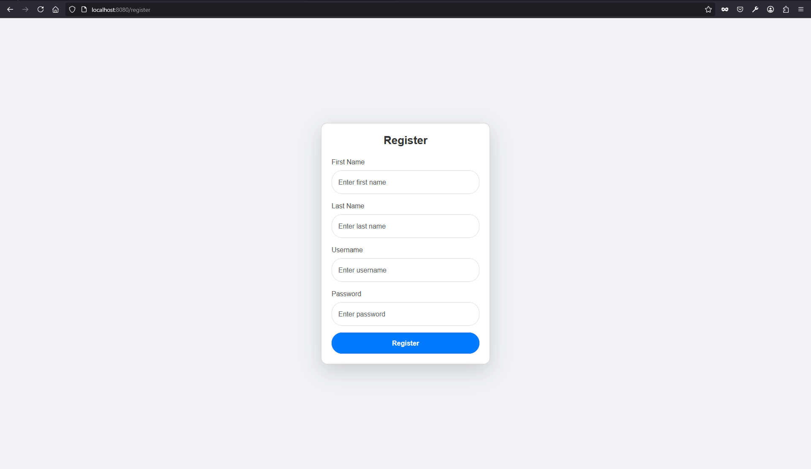
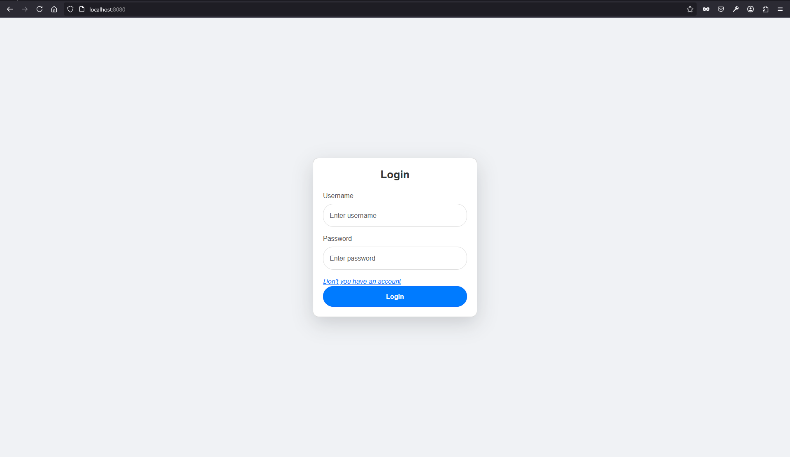
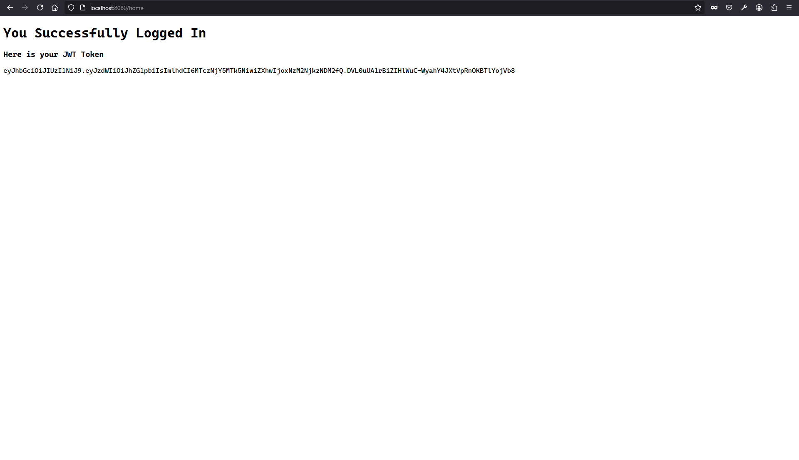
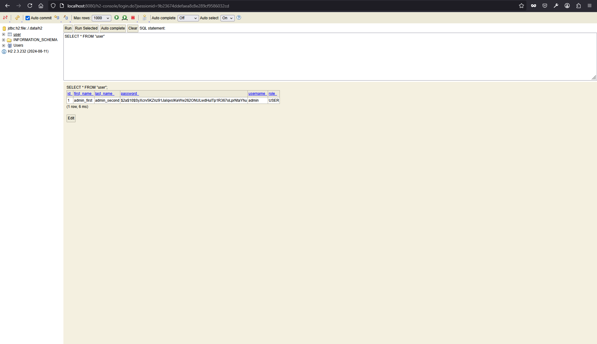

# JWT Authentication Login/Register Application  

  
  
  
  
  

A robust JWT Authentication system built using Spring Boot (Java 21) and Maven. It includes features for **user registration**, **login**, and **authentication** with JWT. This project also contains unit tests for backend functionalities, an embedded H2 database, and simple HTML pages for testing registration and login functionalities.  

---
## 📑 Features  

- **User Registration**: Create new accounts with a secure password.  
  - **Username Requirements**: Must be longer than 3 characters.  
  - **Password Requirements**: Must be longer than 6 characters and contain at least 1 digit.  
  - **Password Encryption**: User passwords are securely stored as encrypted data in the H2 database.  
- **Login Functionality**: Authenticate users using email and password.  
- **JWT Authentication**: JSON Web Tokens for secure API access and session management.  
- **Exception Handling**:  
  - Centralized exception handling to provide meaningful error messages to the client, instead of exposing raw exception messages.  
- **Unit Tests**: Comprehensive backend unit tests using JUnit 5.  
- **H2 Database**: In-memory database for testing and development purposes.  
- **Frontend HTML Pages**: Test register and login functionalities via basic HTML pages.  

---
## Screenshots  

### Registration Page  
  

### Login Page  
  

### Home Page


### H2 Database (user passwords are stored as encrypted)


## 🚀 Technology Stack  

- **Backend**: Spring Boot (Java 21)  
- **Frontend**: Simple HTML  
- **Database**: H2 Database (in-memory)  
- **Build Tool**: Maven  
- **Testing**: JUnit 5  

---

## 📂 Project Structure
    src/main/java 
    ├── com.authentication.authentication
    │    ├── config // Spring Security and JWT Configuration 
    │    ├── controller // REST Controllers for Authentication 
    │    ├── model // Entity Models (e.g., User)
    │    ├── repository // Repositories (e.g., UserRepository) 
    │    ├── service // Business Logic (e.g., AuthenticationService) 
    │    └── utils // Helper classes for JWT creation and validation
    └──...

    src/main/resources
    ├── static // CSS file
    ├── templates // HTML pages for testing register and login 
    └── application.properties // App configurations

    src/test/java 
    └── com.authentication.authentication // Unit Tests

---

## 🛠️ Prerequisites  

- Java 21  
- Maven 4.0+  
- IDE (e.g., IntelliJ IDEA, Eclipse)  

---

## ⚙️ Installation  

1. **Clone the Repository**  
   ```bash
   git clone https://github.com/barispinara/jwt_authentication_springboot.git
   cd jwt_authentication_springboot/authentication
2. **Build the Project**
    ```bash
    mvn clean install
3. **Run the Application**
    ```bash
    mvn spring-boot:run
4. **Access the Application**
    - Open a browser and navigate to `https://localhost:8080`

## 📄 API Endpoints  

| **Endpoint**          | **Method** | **Description**          | **Protected** |  
|------------------------|------------|--------------------------|---------------|  
| `/user/register`           | `POST`    | Register a new user      | Yes            |  
| `/user/login`              | `POST`    | Login and get JWT token  | Yes            |  
| `/home`    | `GET`     | Homepage of the project       | No           |
| `/register`    | `GET`     | Register page  of the project       | No           |
| `/`    | `GET`     | Login page of the project       | No           |


## 🛠️ Testing

1. **Unit Tests**


    Run all backend unit tests:
    ```bash
    mvn test
2. **Manual Testing**


    After running the project, you can test the project manually from `https://localhost:8080`
## 🔧 Configuration  

### H2 Database Console  

The application uses an in-memory H2 database. You can access the H2 console at:

*You can change these properties from `application.properties` if you want*

> `Note:`  H2 Database is set to **create-drop** property in *application.properties* which means that, database clear itself every run. If you are not happy with this configuration you should change it from *application.properties*

- **URL**: [http://localhost:8080/h2-console](http://localhost:8080/h2-console)  
- **Default Credentials**:  
  - **JDBC URL**: `jdbc:h2:file:./.data/h2`  
  - **Username**: `admin`  
  - **Password**: *12345*  

## 🔧 JWT Configuration  

Modify JWT expiration time and secret in the `application.properties` file:

    jwt.secret=your-secret-key
    jwt.expiration=1440000

## 🧪 Unit Test Coverage

The project includes unit tests to validate critical functionalities like user registration, login, and JWT validation.

## 📧 Contact

Feel free to reach out for suggestions or contributions from github issues or PR

